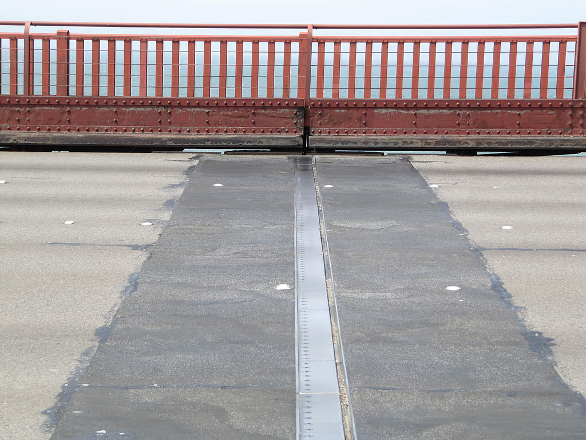
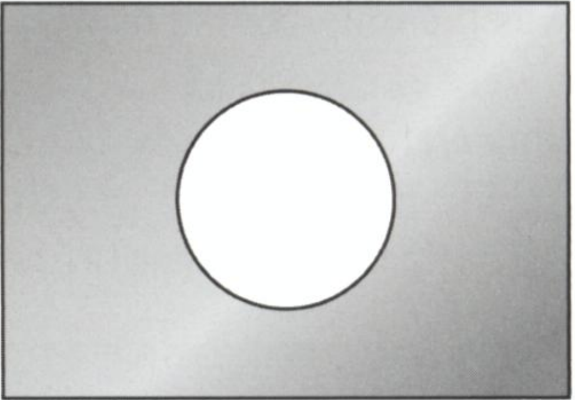
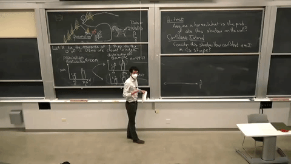
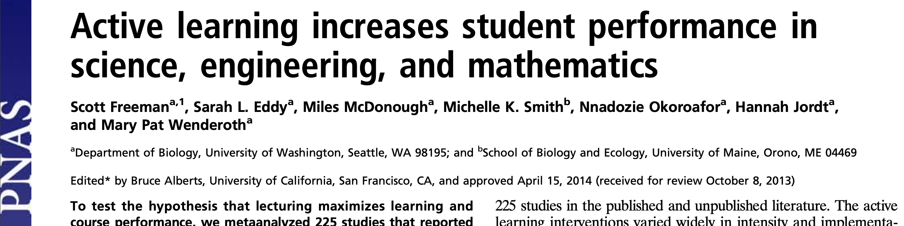
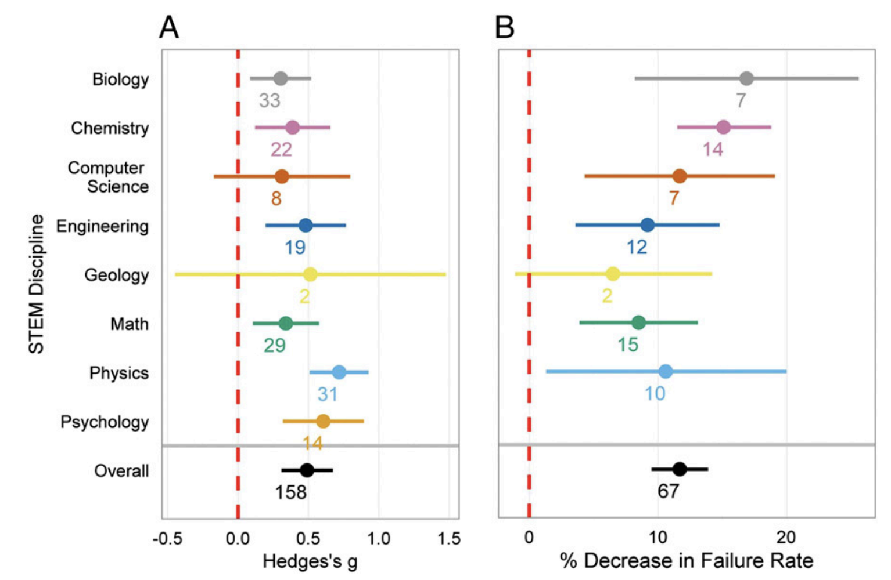
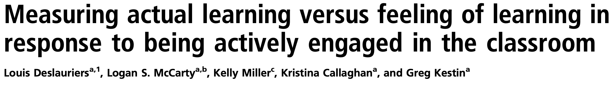
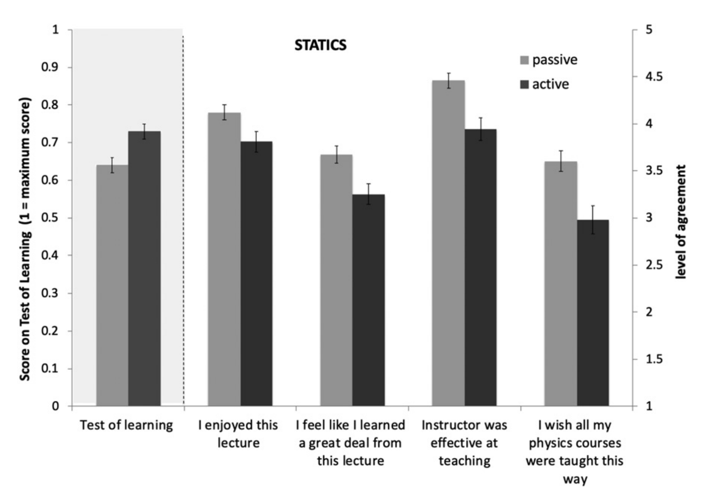
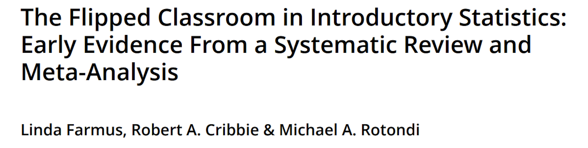
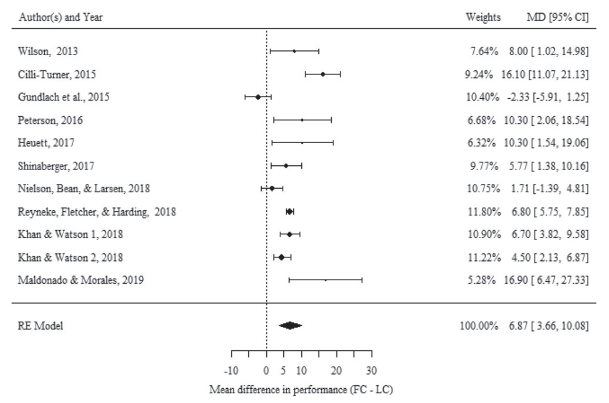

```{r setup, include=FALSE, warning=FALSE}
knitr::opts_chunk$set(message = FALSE, 
                      fig.align = "center",
                      fig.retina = 3,
                      warning = FALSE)

library(tidyverse)
library(emo)
library(xaringanExtra)
library(countdown)
xaringanExtra::use_panelset()
```

## While you're waiting

.pull-left[
Most discussion sections at Cal take some version of the form:

1. GSI gives Mini-Lecture
2. Students work on practice problems
3. GSIs go over answers

As a GSI and as a student, please think through at least two ways that you've seen step 2 fail. Enter your response on the padlet linked at `bit.ly/3pxnBeQ`. 
]

.pull-right[
```{r echo = FALSE}
plot(qrcode::qr_code("https://padlet.com/andrewbray1/dg3va5w4unc3koby"))
```
]

---
## Agenda

1. Reflections from teaching
2. Example: Thermal Expansion
3. Active Learning
    - What is it?
    - Why do it?
4. Active Learning in Practice
    - Peer Instruction
    - Think-pair-share
5. Break
6. Traps to avoid
7. Teaching observations

---
class: middle, center, inverse

# Reflections from teaching

---
## Reflections from teaching

.task[
In your groups, take turns sharing:

1. One thing that went well
2. One thing that went poorly
3. One thing you learned
]

```{r echo = FALSE}
countdown(minutes = 10, bottom = 0)
```

---
class: middle, center, inverse

## Example: Thermal Expansion

---
## Thermal Expansion

.pull-left[
```{r echo = FALSE, out.width = "100%"}

```
]

--

.pull-right[
- As materials heat up, the atoms vibrate more vigorously.
- The more they vibrate, the more space they require.
]

.cite[source: Michiel1972, CC BY-SA 3.0 <https://creativecommons.org/licenses/by-sa/3.0>, via Wikimedia Commons]

---
## Peer Instruction Protocol

1. Context

--

2. Question

--

3. Poll: 1 min

--

4. Discuss: 4 min

--

5. Re-poll: 30 sec

--

6. Share

--

7. Explain


---
## Question: The Heated Metal Plate

.pull-left[
Consider a rectangular metal plate with a circular hole in it.

When the plate is uniformly heated, the diameter of the hole

1. increases.
2. stays the same.
3. decreases.
]

.pull-right[
```{r echo = FALSE, out.width = "70%"}

```
]

.task[
Enter your response at `pollev.com/andrewbray088`.
]
```{r echo = FALSE}
countdown::countdown(1, warn_when = 10)
```

---
## Question: The Heated Metal Plate, Dicuss

.pull-left[
Consider a rectangular metal plate with a circular hole in it.

When the plate is uniformly heated, the diameter of the hole

1. increases.
2. stays the same.
3. decreases.
]

.pull-right[
```{r echo = FALSE, out.width = "70%"}

```
]

.task[
Discuss with $\ge 1$ person with a **different answer**.
]
```{r echo = FALSE}
countdown::countdown(4, warn_when = 10)
```

---
## Question: The Heated Metal Plate, Repoll

.pull-left[
Consider a rectangular metal plate with a circular hole in it.

When the plate is uniformly heated, the diameter of the hole

1. increases.
2. stays the same.
3. decreases.
]

.pull-right[
```{r echo = FALSE, out.width = "70%"}

```
]

.task[
Enter your response at `pollev.com/andrewbray088`.
]
```{r echo = FALSE}
countdown::countdown(minutes = 0, seconds = 30, warn_when = 10)
```


---
## Re-poll

<center>
<iframe src="https://embed.polleverywhere.com/multiple_choice_polls/jcDJNepIEBDVQppURn7Mn?controls=none&short_poll=true" width="600px" height="450px"></iframe>
</center>


---
## Original Poll

<center>
<iframe src="https://embed.polleverywhere.com/multiple_choice_polls/Y2Bfgq8LuGy6RsLPaC6Lr?controls=none&short_poll=true" width="600px" height="450px"></iframe>
</center>

---
## Answer: The Heated Metal Plate

.pull-left[
Consider a rectangular metal plate with a circular hole in it.

When the plate is uniformly heated, the diameter of the hole

1. **increases.**
2. stays the same.
3. decreases.
]

.pull-right[
```{r echo = FALSE, out.width = "70%"}

```
]

---
class: middle, center, inverse

## Active Learning


---
## What your student's lectures look like

```{r echo = FALSE, out.width = "80%"}

```

---
## What your student's discussions look like

--

```{r echo = FALSE, out.width = "15%"}

```

1. 10 min mini-Lecture

--

2. Students work on practice problems

--

3. Go over answers


---
## When do lectures succeed? When do lectures fail?

???
Solicit student contributions based on their responses to the assignment and writing them on the board.

---
## Active learning

> Those who does the work do the learning.

--

- _Active learning_ generally refers to any instructional method that engages students in the learning process beyond listening and passive note taking.

--

- Often but not exclusively includes collaborative learning in small groups.

--

.pull-left[
**Transmissionist View:** 
I know a lot about this topic, and you need to learn it, so I will transmit my knowledge to you by telling you about it.

Recall Felienne Hermans (`r emo::ji("smiley_cat")` `r emo::ji("heart")` `r emo::ji("cake")`)
]

.pull-right[
**Constructivist View:** 
I know a lot about this topic that you need to learn about, so I will create situations and challenges for you that will make it easier for you to efficiently construct knowledge about this topic for yourself. 
]

---
## Evidence for Active Learning, Study 1
--

```{r echo = FALSE, out.width = "100%"}

```

--

> These results indicate that average examination scores improved by about 6% in active learning sections, and that students in classes with traditional lecturing were 1.5 times more likely to fail than were students in classes with active learning

---
## Evidence for Active Learning, Study 1

```{r echo = FALSE, out.width = "70%"}

```

---
## Evidence for Active Learning, Study 1

> _If the experiments analyzed here had been conducted as randomized controlled trials of medical interventions, they may have been stopped for benefit—meaning that enrolling patients in the control condition might be discontinued because the treatment being tested was clearly more beneficial._

---
## Evidence for Active Learning, Study 2
--

```{r echo = FALSE, out.width = "100%"}

```

---
## Evidence for Active Learning, Study 2

> _We compared students’ self-reported perception of learning with their actual learning under controlled conditions in large enrollment introductory college physics courses taught using 1) active instruction (following best practices in the discipline) and 2) passive instruction (lectures by experienced and highly rated instructors). Both groups received identical class content and handouts, students were randomly assigned, and the instructor made no effort to persuade students of the benefit of either method. Students in active classrooms learned more (as would be expected based on prior research), but their perception of learning, while positive, was lower than that of their peers in passive environments. This suggests that attempts to evaluate instruction based on students’ perceptions of learning could inadvertently promote inferior (passive) pedagogical methods._

---
## Evidence for Active Learning, Study 2

```{r echo = FALSE, out.width = "70%"}

```

---
## Evidence for Active Learning, Study 3
--

```{r echo = FALSE, out.width = "100%"}

```

> _Results indicate that students in the FC had statistically discernibly higher final performance outcomes compared to the LC delivery with an average difference of 6.9% in performance (Hedge’s g = 0.43), though there was evidence of moderation by the presence of weekly in-class quizzes._

---
## Evidence for Active Learning, Study 3

```{r echo = FALSE, out.width = "80%"}

```

---
## Critiquing the evidence

.task[
Take a moment to write down _three_ critiques of this line of evidence, or three questions that you have about its efficacy.
]

```{r echo = FALSE}
countdown::countdown(1.5, warn_when = 10)
```

---
## Critiquing the evidence

Take a moment to write down _three_ critiques of this line of evidence, or three questions that you have about its efficacy.

.task[
Discuss your critiques with a neighbor.
]

```{r echo = FALSE}
countdown::countdown(3, warn_when = 10)
```

---
## Critiquing the evidence

Take a moment to write down _three_ critiques of this line of evidence, or three questions that you have about its efficacy.

Discuss your critiques with a neighbor.

Share your discussion with the class.


---
## Active learning protocols
--

1. Peer Instruction (Mazur, 1997)


---

<iframe width="1120" height="630" src="https://www.youtube.com/embed/Z9orbxoRofI" title="YouTube video player" frameborder="0" allow="accelerometer; autoplay; clipboard-write; encrypted-media; gyroscope; picture-in-picture" allowfullscreen></iframe>

---
## Peer Instruction Protocol

1. _Context:_ 
--
provide new model/language for familiar phenomenon.

--
2. _Question:_ 
--
calibrated to be in the sweet spot of challenging but not too challenging.

--
3. _Poll (1 min):_ 
--
students wrestle individually, commit to answer, prepare to explain.

--
4. _Discuss (4 min):_ 
--
explaining can air misunderstanding, peers can be good teachers.

--
5. _Re-poll (30 sec):_ 
--
groups commits to answer, prepares to explain, feedback to instructor.

--
6. _Share:_ 
--
air common misunderstandings.

--
7. _Explain:_ 
--
resolve tension in conflicting answers.


---
## Active learning protocols

1. Peer Instruction (Mazur, 1997)

--

2. Think-Pair-Share


---
## Think-Pair-Share Protocol
--

1. _Think:_ 
--
give students ~1 minute to consider the question and articulate their thinking (usually in writing).

--
2. _Pair_: 
--
students take turns explaining their thinking to a peer.

--
3. _Share_: 
--
pairs share their thinking with the class to air correct and incorrect conceptions.

---
## Example: Teaching as a Team: Poorly

Consider a specific aspect of or incident in your working relationship with your teaching team that has gone _poorly or could be improved_.

1. **Think**: write a short description on the padlet.
2. **Pair**: share your experience with a partner and discuss.
3. **Share**: whole class discussion.

???
Example from last time of TPS

---
## Example: Critiquing the evidence

**Think**: Take a moment to write down _three_ critiques of this line of evidence, or three questions that you have about its efficacy.

**Pair**: Discuss your critiques with a neighbor.

**Share**: Share your discussion with the class.

???
Example from this time of TPS

---
## Think-Pair-Share Protocol
--

1. _Think:_ 
give students ~1 minute to consider the question and articulate their thinking (usually in writing).

2. _Pair_: 
students take turns explaining their thinking to a peer.

3. _Share_: 
pairs share their thinking with the class to air correct and incorrect conceptions.

--

> How can this fail?


---
## Active learning protocols

1. Peer Instruction (Mazur, 1997)

2. Think-pair-share
--

3. Purposeful pause

4. Quick writes


---
## Purposeful pause

Instructor pauses every ~15 minutes during lecture and asks students to:

- Take a couple of minutes to summarize in writing what they just learned and jot down any questions or confusions or.

- Turn to a neighbor and discuss and rework their notes in pairs, including identifying questions or confusions.

---
## Quick writes

Instructor poses a prompt that students respond to in writing for ~5 minutes or less.

- prompt might be a conceptual question, or metacognitive/reflective(link is external) question, including asking students to identify the most important takeaway or a point of confusion.

- can be implemented at many points during a lecture, combined with small- or large-group discussion, and may be collected to inform future class sessions

- if graded, points are typically awarded for completion/participation.

---
class: center, middle

# Break

```{r echo = FALSE}
countdown::countdown(5)
```


---
class: center, middle, inverse
# Traps and how to avoid them

???
- Unstructured time with answers guaranteed
- Group work reverts to solo work
- Group work strays off topic

---
## While you're waiting

.pull-left[
Most discussion sections at Cal take some version of the form:

1. GSI gives Mini-Lecture
2. Students work on practice problems
3. GSIs go over answers

As a GSI and as a student, please think through at least two ways that you've seen step 2 fail. Enter your response on the padlet linked at `bit.ly/3pxnBeQ`.
]

.pull-right[
```{r echo = FALSE}
plot(qrcode::qr_code("https://padlet.com/andrewbray1/dg3va5w4unc3koby"))
```
]

---
## Traps and how to avoid them

.task[
In groups of 4, discuss each of the failure modes and brainstorm a 2 - 5 methods that can be used to avoid them or short-circuit them when they occur. Designate one of your group members to take notes and another as the spokesperson.
]

```{r echo = FALSE}
countdown::countdown(8)
```


???
During the break, look over the padlet and collect common failure modes and write them on the boards as headings. When the students have completed their discussion, go group by group and ask for the spokesperson to contribute a few thoughts to each heading.

---
## Your assignment for next class

1. Select an active learning protocol to implement in your next class: Peer Instruction, Think-Pair-Share, Purposeful Question, Quick Write, Other...

--

2. Write a detailed description of how you will facilitate it, including
    - the concept question / prompt
    - timing of each element
    - precisely what students will be asked to do
    - how groups will be formed
    
--

3. Reflect on how it went
    - how did it feel to facilitate?
    - in what ways was it effective/ineffective?

---
class: middle, inverse, center
# Teaching Observations

---
## Teaching Observations, Round 2

.task[
Find a _new_ partner to observe with over the coming weeks.
- Decide on a time that will work for each to observe the other in person.
- Both people need to fill out the observation google form.

Your observations must be complete two weeks from now: November 8th.
]

https://forms.gle/HrsuEvQD4A63eySt9

---

## References

- UC Berkeley CTL, [_What is Active Learning?_](https://teaching.berkeley.edu/resources/course-design-guide/active-learning)
- UC Berkeley CTL Teaching Excellent Colloquium Workshop on Active Learning
